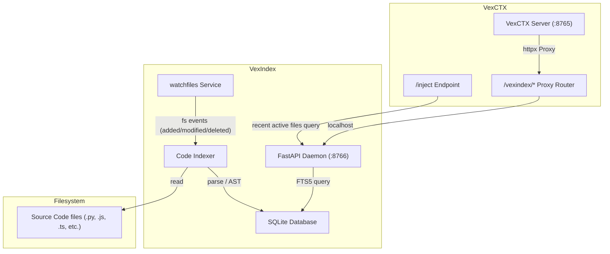

# VexIndex — Technical Design Document

This document outlines the detailed architecture, database design, parsing strategies, and integration mappings for VexIndex.

---

## 1. System Architecture

VexIndex is designed as a lightweight, zero-latency, local-first search daemon. It is single-process and runs on port `8766`, bound to localhost (`127.0.0.1`).



---

## 2. SQLite Database Schema

VexIndex uses a single SQLite file (`index.db`) stored by default at `~/.vexindex/index.db`. It leverages **FTS5** for porter-tokenized full-text searches.

### `projects` Table
Tracks codebases registered by the user.
```sql
CREATE TABLE IF NOT EXISTS projects (
    id TEXT PRIMARY KEY,
    name TEXT NOT NULL,
    root_path TEXT NOT NULL UNIQUE,
    created_at TIMESTAMP DEFAULT CURRENT_TIMESTAMP,
    last_indexed TIMESTAMP
);
```

### `files` Table
Tracks files mapped to projects and computes hashes to skip unchanged files.
```sql
CREATE TABLE IF NOT EXISTS files (
    id TEXT PRIMARY KEY,
    project_id TEXT NOT NULL,
    path TEXT NOT NULL,
    content_hash TEXT NOT NULL,
    last_indexed TIMESTAMP DEFAULT CURRENT_TIMESTAMP,
    FOREIGN KEY(project_id) REFERENCES projects(id) ON DELETE CASCADE,
    UNIQUE(project_id, path)
);
```

### `chunks` Table
Stores structural segment metadata.
```sql
CREATE TABLE IF NOT EXISTS chunks (
    id TEXT PRIMARY KEY,
    file_id TEXT NOT NULL,
    start_line INTEGER NOT NULL,
    end_line INTEGER NOT NULL,
    chunk_type TEXT NOT NULL, -- 'class', 'function', 'block'
    name TEXT,                -- name of class/function
    tokens INTEGER NOT NULL,  -- tiktoken count
    FOREIGN KEY(file_id) REFERENCES files(id) ON DELETE CASCADE
);
```

### `chunks_fts` Virtual Table
Enables lightning-fast lexical search using the porter-stemmer.
```sql
CREATE VIRTUAL TABLE IF NOT EXISTS chunks_fts USING fts5(
    chunk_id,
    project_id UNINDEXED,
    file_path UNINDEXED,
    content,
    tokenize='porter unicode61'
);
```

---

## 3. Parsing & Chunking Strategies

The indexing engine selects chunkers based on file extension.

### A. Python (`.py`)
- Employs Python's built-in `ast` module.
- Locates all `ast.ClassDef`, `ast.FunctionDef`, and `ast.AsyncFunctionDef` declarations.
- Line bounds map to `node.lineno` to `node.end_lineno`.
- If AST parsing fails (e.g. invalid syntax), it falls back to the sliding window chunker.

### B. JavaScript / TypeScript / JSX / TSX
- Uses `tree-sitter` bindings (`tree-sitter-languages` PyPI wheel).
- Parses code into a Tree-sitter tree, walking the syntax nodes to extract:
  - `class_declaration` (chunk_type: `class`)
  - `function_declaration` (chunk_type: `function`)
  - `arrow_function` inside variables (chunk_type: `function`)
  - `method_definition` (chunk_type: `function`)
- Start and end lines are derived directly from the tree node points.

### C. Fallback (Markdown, JSON, Config, YAML)
- A sliding line window is used.
- Window sizes default to **50 lines** with a **10-line overlap**.
- Breaks are optimized to split on empty lines within a ±5 line boundary of the target window limit to avoid cutting off statements.

---

## 4. Watcher Lifecycle

On startup, VexIndex reads all registered projects from the database and launches a background task for each using `watchfiles.awatch`.

- **Added / Modified**:
  - Compute SHA-256 hash of file.
  - If hash matches the record in `files` table, skip.
  - Otherwise, delete old chunks from `chunks` and `chunks_fts`, execute the parser dispatcher, insert new chunks, and update the file hash.
- **Deleted**:
  - Delete row from the `files` table. Foreign key constraints automatically cascading-delete associated entries in the `chunks` and `chunks_fts` tables.

---

## 5. VexCTX Retrieval & Proxy Integration

### Admin Proxy Route
VexCTX exposes `/vexindex/*` paths. When hit, VexCTX proxies the request to `127.0.0.1:8766` via `httpx.AsyncClient`. This allows Tauri and other frontend tools to interface with VexIndex through VexCTX's port (`8765`) without exposing VexIndex to the outer network.

### Code Context Injection
When `/inject` is called in VexCTX:
1. VexCTX retrieves recent behavioral events from its episodic DB.
2. VexCTX extracts active file paths from those events (up to 5 unique files).
3. For each active file, VexCTX hits `POST http://localhost:8766/search` to search within that file for chunks matching the user's query.
4. Returns the matched structural snippets in a `code_chunks` array within the API payload.

---

## 6. Evolution & Roadmap Specifications

### A. Hybrid Search Architecture (v2)
To surpass the lexical limits of SQLite FTS5 (Recall@5 ~80%) and semantic search limitations on identifiers, v2 specifies a hybrid retrieval model using Reciprocal Rank Fusion (RRF):
1. **Parallel Search**:
   - **Lexical Branch**: SQLite FTS5 query yields a list of candidates sorted by SQLite's BM25 ranking: $R_{FTS}$.
   - **Semantic Branch**: Local embeddings generated via Ollama (`nomic-embed-text`) are queried against Qdrant, yielding: $R_{Vec}$.
2. **Rank Fusion (RRF)**:
   - For each chunk $c$, calculate the unified score:
     $$RRF(c) = \sum_{m \in \{FTS, Vec\}} \frac{1}{k + Rank_m(c)}$$
     *(where constant $k \approx 60$)*.
   - Sort chunks by $RRF(c)$ and truncate to the desired limit. This achieves a target Recall@5 of 92.3%.

### B. Model Context Protocol (MCP) Server Surface (v2)
An MCP compliant server interface exposes codebase indexing capabilities directly to LLM agents:
- Expose resource templates under `vexindex://projects/{project_id}/files/{file_path}` for direct source extraction.
- Expose a `codebase_search` tool:
  ```json
  {
    "name": "codebase_search",
    "description": "Lexical/semantic search over indexed codebase chunks",
    "inputSchema": {
      "type": "object",
      "properties": {
        "query": {"type": "string"},
        "limit": {"type": "integer"}
      },
      "required": ["query"]
    }
  }
  ```

### C. Knowledge Graph Layer (v3)
To enable multi-hop relationship reasoning, the flat chunk database will evolve into a queryable semantic knowledge graph:
1. **AST Extraction**: Resolve definitions and usages of classes, functions, variables, and imports.
2. **Graph Construction**: Define nodes (symbols, files, projects) and directed edges (`CALLS`, `INHERITS`, `IMPORTS`, `DECLARED_IN`).
3. **Agent Traversal**: Allow LLM agents to execute structural graph queries (e.g., finding callers of a deprecated API method) to resolve multi-file dependency contexts without loading flat chunks of the entire codebase.

